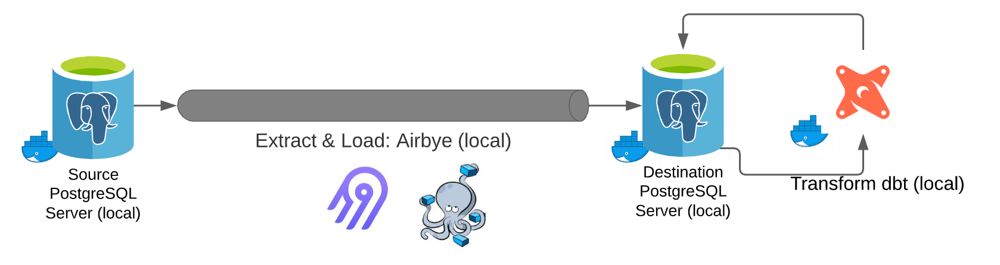
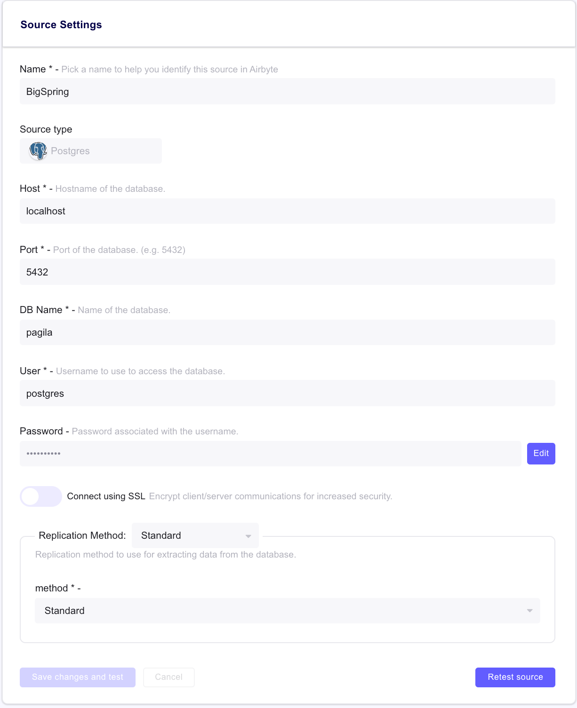
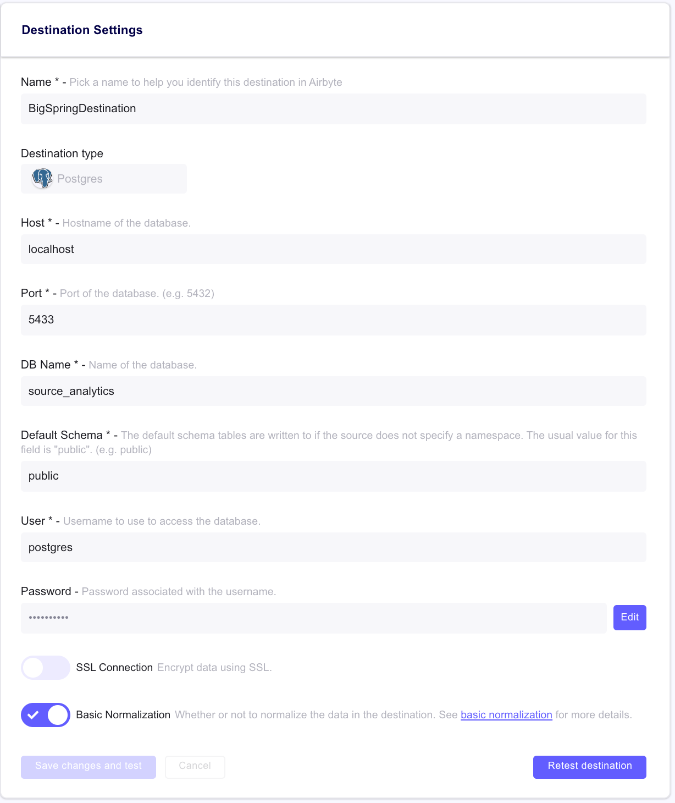
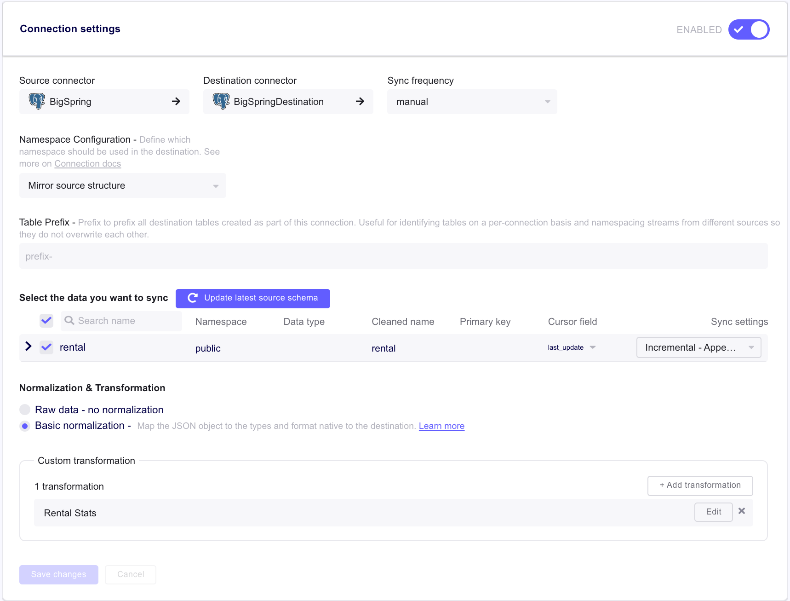

## Testing dbt project: `pagila_psql`

`pagila` is a fictional video rental store. This project moves data from a source psql database to a destination database with the goal of writing outstanding rentals and returned rentals for a given week. 

  |  WeekBeginning | OutstandingRentals  |  ReturnedRentals |
  |---|---|---|
  |  2018-01-08 |  800 | 200  |
  |  2018-01-15 | 750  |  222 |

## Infrastructure/Tooling

<figure>
  
  <figcaption href="https://docs.airbyte.io/understanding-airbyte/high-level-view">Behind the Airbyte Stack</figcaption>
</figure>

## Required Tooling
[Airbyte](https://docs.airbyte.io/): This is used for the extract and load portion of the ETL pipeline

[dbt](https://docs.getdbt.com/docs/introduction): This is used for a the transformation execution

[PostGres](https://www.postgresql.org)*: This is used as the defacto RDMS

[Docker](https://docs.docker.com/get-docker/): The containerization tooling of choice for the local deployment

[Docker Compose](https://docs.docker.com/compose/): Helps facilitate communication amongs containers in the local deployment for ease of standing the dockerized applications up

** PostGres source and destination databases run in their own docker containers and need to be stood up locally
** Airbyte runs on Docker compose and requires some configuration in the local UI

### Docker & Docker Compose
While this repository doeesn't require too much familiarity with Docker aside from pullinh containers, we do require it to run all of our applications seemlessly, as mentioned above. Installation steps can be found [here]((https://docs.docker.com/get-docker/))

Additionally, Docker Compose is not going to be directly used within the repository, but it is required for Airbyte to be installed. Following the installation instructions [here](https://docs.docker.com/compose/install/)

### PostGres Source Database
In order to setup the source database see [this repository](https://github.com/devrimgunduz/pagila) for installation instructions to setup and populate a local psql instance on a docker container. 

* Note during docker run to build the image instead of running `docker run --name postgres -e POSTGRES_PASSWORD=secret` as is called out in the linked repos instructions. Please run `docker run --name destination_db -e POSTGRES_PASSWORD=secret -p 5432:5432 -d postgres` to expose port 5432 for local ascess. 

### PostGres Destination Database
In order to setup the destination database see, we need to create a new postgres image. In the source databse setup the docker container has already been pulled locally. In order to allow both containers to run simulatenously. We need to modify the previous docker run command in two specific areas. First we need to change the name to avoid any name conflicts, in this case it's named destination DB, we also need to modify the port argument to read `-p 5433:5432`, this will forward the port on the docker container to port 5433 on the local host. 

The docker command for this (assuming this is subsequent to the source db setup) is as follows. ``docker run --name destination_db -e POSTGRES_PASSWORD=secret -p 5433:5432 -d postgres`

Once the build is complete run the following command: 
- `docker exec -it destination_db  psql -U postgres`

Once inside the PSQL command line run:
- `CREATE DATABASE source_analytics`

From here you can `\q` out and turn to setting up Airbye. 

### Airbyte
Airbyte allows for ease of setting up extract / load pipelines between a variety of connectors. In this case we need to move data from our source to our destination with the transform leg of the (ETL) coming next.

To install Airbyte, follow the steps outlined [here](https://docs.airbyte.io/deploying-airbyte/local-deployment).

Once the docker compose container is up and running the local UI should be accessable on `localhost:8000`

We need to setup the source & destination connectors:

<figure>
  
  <figcaption>Source Airbyte PSQL config</figcaption>
</figure>

<figure>
  
  <figcaption>Source Airbyte PSQL config</figcaption>
</figure>

Subsequent to the connections being established, we need to establish a Connection and populate the requisite features. 

<figure>
  
  <figcaption>Source Airbyte PSQL config</figcaption>
</figure>

Aside from configuring the source and destination connectors correctly as pictured the data type to sync section warrants additional detail. 

In the current iteration, *rental* is the only table being replicated. See Next Steps below for tables to be replicated in future versions. 
Within rentals, we've selected `Incremental - Append` as the Sync behavior, meaning when the EL pipeline runs, only new/updated records will be brought over. We've indicated via the Cursor_field that the last_updated column is to be used to determine when a record has been inserted/updated since the last sync. 

Additionally, we've selected *Basic Normalization* - this allow us to take advantage of pre defined type casting logic available within Airbyte. * Note this currently turns timestamp data types into strings. As such, we have to wrap one more piece of logic in the tranformation built in the dbt to acomodate this type change. 

Lastly, we leverage dbt to create a *Custom transformation*, which allows for the create/update of the rental statistics table as a scheduled sync is executed. See the dbt secetion below for additional detail. 

### DBT (data build tool)

Airbyte, while focusing on extract/load, allows for dbt to be integrated with their tooling to facilitate transformation actions. Given the current infrastructure is on prem/locally hosted, the dbt cli was leveraged in facilitating the curation/validation of the transformation logic. 

To configure dbt to run with Airbyte, populate the transformation section with the information pictured below: 

<figure>
  
  <figcaption>Source Airbyte PSQL config</figcaption>
</figure>

## Assumptions / Data Validations
- Rental Week: Defined as the week the year resides in for simplicity using DATE_PART
- There are no issues with a rental date being after a return date (validated), nor will the current system setup allow for this in the future (Assumption)
- No back dating entries are allowed within the source system (once a day has passed someone couldn't log that the video was returns 3 days prior)
- last_updated of the rental table is a reliable souce for incremental backups. 

---
For more information on dbt:
- Read the [introduction to dbt](https://docs.getdbt.com/docs/introduction).
- Read the [dbt viewpoint](https://docs.getdbt.com/docs/about/viewpoint).
- Join the [dbt community](http://community.getdbt.com/).
---
